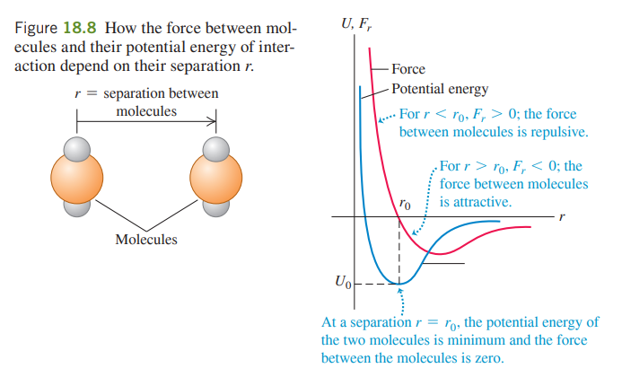

# 教学大纲
Lecture 1: Introduction, Thermodynamic properties \& the 0th law of Thermodynamics, Thermal Expansion

Lecture 2: Heat, Heat Capacity, Quantity of Heat, Phase Change and Mechanisms of Heat Transfer 

Lecture 3: Equations of State, Molecular properties of Matter

Lectures 4: Kinetic – Molecular Model of an Ideal gas, Heat Capacities

Lectures 5: Molecular Speeds \& Phases of Matter 

Lectures 6: The 1st law of thermodynamics (Chapter 19)

Lectures 7: Thermodynamic processes (Chapter 19)

Lectures 8: Specific heat capacity \& Carnot cycle (Chapters 18 \& 20)

Lectures 9: Heat engines \& The 2nd law of thermodynamics (Chapter 20)

Lectures 10: Refrigerators and heat pumps \& Free energies and laws of thermodynamics (Chapter 20)

# 重要提示

$\Delta T$ 注意温度是上升（+）还是下降（-）

# 热平衡和热力学第零定律

多个物体处于热平衡（thermal equilibrium）状态，当且仅当物体之间、物体和环境之间都没有热量交换。

热力学第零定律：如果两个热力学系统中的每一个都与第三个热力学系统处于热平衡(温度相同)，则它们彼此也必定处于热平衡状态。

# 膨胀

## 热膨胀
热膨胀系数是温度每升高一个单位时，物体较原先膨胀的比率。由于物体的大小可以用一个方向的尺寸（长度）或体积衡量，实际应用中，有两种主要的热膨胀系数，分别是：

线性热膨胀系数（coefficient of linear thermal expansion，线胀系数）

$${\displaystyle \alpha ={\frac {1}{L}}\cdot {\frac {\mathrm {d} L}{\mathrm {d} T}}\approx {\frac {1}{L}}\cdot {\frac {\Delta L}{\Delta T}}}$$

和体积热膨胀系数(其中下标$p$表示保持压强不变。)

$${\displaystyle \gamma ={\frac {1}{V_{0}}}\left({\frac {\partial V}{\partial T}}\right)_{p}}$$

对各向同性物料，线膨胀系数$\alpha$ 与体膨胀系数$\gamma$ 的关系为${\displaystyle \gamma =3\alpha }$，两者的量纲均为$K^{-1}$。

## 热膨胀压力

杨氏模量（Young's modulus），是材料力学中的名词。弹性材料承受正向应力时会产生正向应变，在形变量没有超过对应材料的一定弹性限度时，定义正向应力与正向应变的比值为这种材料的杨氏模量。公式记为:

$$ E={\frac {\sigma }{\varepsilon }}$$

其中，$E$ 表示杨氏模量，$\sigma = \frac{F}{A}$  表示正向应力，$ \varepsilon = \frac{\Delta L}{L_0}$ 表示正向应变。

$$\frac{F}{A} = -Y\alpha \Delta T$$

其中，$F$表示需要使杆保持原始长度的力，$A$表示棒的横截面积，$Y$表示杨氏模量，$\alpha$表示线性热膨胀系数，$\Delta T$表示温度变化。量纲为$\frac{N}{m^2}$。

# 比热容

## 基于质量的比热

$$Q = m c \Delta T$$

比热（specific heat）$c = \frac{1}{m}\frac{dQ}{dT}$，量纲为$J/(kg\cdot K)$

## 基于物质的量的比热

$$m = nM$$

其中$m$是物质质量，$n$是物质的量，$M$是物质的摩尔质量。

$$Q = nM c \Delta T = n (Mc) \Delta T = n C \Delta T$$

摩尔比热（molar specific heat / molar heat capacity）$C = \frac{1}{n}\frac{dQ}{dT}$，量纲为$J/(mol\cdot K)$

需要注意，热容(heat capacity)的概念不是物体所包含的热量，而是物体得到/失去的热量。

# 相变

相变进行过程中的热量取决于相变潜热$L$和物质的质量$m$。

$$Q = \pm mL$$

比如，水蒸发过程的潜热是（heat of vaporization） $L_v = 2.256 \times 10^6 J/kg$

# 传热机理

一共有三种传热机理（Mechanisms of Heat Transfer），分别是传导（conduction）、对流（convection）和辐射（radiation）。

## 热传导

$$H = \frac{dQ}{dT} = kA\frac{T_H - T_C}{L}$$

$H$是热流速（heat current），热传导率（thermal conductivity）$k$取决于材料，单位长度温差（temperature difference per unit length）为$\frac{T_H - T_C}{L}$，$A$为材料的横截面积。

## 热对流

$$\dot{ Q}_{conv} = hA (T_2 - T_1)$$

$h$是传热系数

## 热辐射

$$H = Ae \sigma T^4$$

以上公式是斯特藩-玻尔兹曼辐射定律（ Stefan–Boltzmann law）。

斯特藩-玻尔兹曼常数（Stefan–Boltzmann constant）记作 $\sigma= 5.67037442 \times 10^{-8} W/(m^2 \cdot K^4)$。

发射面面积（Area of emitting surface）为$A$，表面反射率（Emissivity of surface）$0 <e <1$。$T$为开氏温标

# 物质的分子性质

## 分子间受力

以上势能图像称为势阱 (potential well)， $|U0|$ , the “depth” of the potential well

## 摩尔数与阿伏伽德罗常量

1摩尔是指含有$6.02*10^{23}$的物质的量基本实体。阿伏伽德罗常量$N_A = 6.02*10^{23}$。

$$M = N_Am$$

$M$是物质的摩尔质量，也就是1摩尔的该物质的质量，$N_A$是阿伏伽德罗常量，$m$是该物质单个分子的量。

# 理想气体的动力学分子模型

假设：

1.体积为V的容器包含N（很大）个相同的分子，每个分子的质量为m。

2.与容器的大小和分子之间的平均距离相比，分子可以视作质点。

3.分子在不断运动。每个分子偶尔会与容器的壁碰撞。这些碰撞是完全弹性的。

4.容器壁是刚性的，并且是无限大的，并且不会移动。

## 压强公式的推导

$$pV = nRT = \frac{m}{M}RT$$

其中$m (kg)$是气体质量，$M (kg\cdot mol^{-1})$是气体的摩尔质量，$R=8.314 J\cdot mol ^{-1}\cdot K ^{-1}$是气体常量.

假设粒子只在一个长方体的平行的两个面之间碰撞，并且粒子之间不会互相干扰，并且在垂直面的方向上的速度是$v_{ix}$，则该粒子在该方向上的动量为$P_{ix} = m_0 \cdot v_{ix}$，碰撞后的动量变化为$\Delta P_{ix} = -2m_0 v_{ix}$。

在$\Delta t$时间内，与$A_1$面的碰撞次数为:

$$Z_i = \frac{v_{ix}\Delta t}{2l_x}$$

设分子受到的平均作用力为$\overline{F_i'}$,那么器壁受到的平均作用力为$\overline{F_i}$

$$\overline{F_i'}\Delta t = Z_i \Delta P_{ix} = \frac{v_{ix}\Delta t}{2l_1}\times (-2m_0V_{ix}) = -\frac{m_0 v_{ix}^2\Delta t}{l_1}$$

即：

$$\overline{F_i'} = -\frac{m_0 v_{ix}^2}{l_1},\overline{F_i} = \frac{m_0 v_{ix}^2}{l_1}$$

$N$个分子对器壁$A_1$面的平均冲力为

$$\overline{F} = \sum _{i=1}^{N} \overline {F_i} = \frac{m_0}{l_1} {v_{ix}^2} = \frac{m_0N\overline {v_x}^2}{l_1}$$

$$p = \frac{\overline{F}}{A_1} = \frac{m_0N\overline {v_x}^2}{l_1l_2l_3} = \frac{m_0N\overline {v_x}^2}{V}$$

$$p=\frac{m_0N\overline {v_x}^2}{V} = m_0 n_{\rho} \overline{v_x}^2$$

其中，$n_{\rho}$是分子密度数。$\overline{v_x}^2 = \overline{v_y}^2 = \overline{v_z}^2 = \frac{1}{3}\overline{v}^2$，同时又有$\overline{\epsilon _{kt}} = \frac{1}{2}m_0 \overline{v}^2$

$$p = \frac{1}{3}m_0 n_{\rho} \overline{v}^2 = \frac{2}{3} n_{\rho} \overline{\epsilon _{kt}}$$

同时:

$$pV = nRT$$

$$p = \frac{1}{V} \frac{N}{N_A}RT = \frac{N}{V} \frac{R}{N_A}T = n_{\rho}\frac{R}{N_A}T =n_{\rho}k_B T$$

$$p = \frac{1}{3} m_0 n_\rho v^2 = \frac{1}{3} n_\rho m_0 v^2 = \frac{2}{3}n_\rho \overline{\epsilon _{kt}}$$

接下来推导分子平动动能和温度的关系。

$$p = \frac{2}{3} \times \frac{N}{V} \times \overline{ \epsilon _{kt}}$$

$$\overline{ \epsilon _{kt}} =\frac{3}{2} \frac{pV}{N} = \frac{3}{2}\frac{nRT}{N} = \frac{3}{2}\frac{RT}{N_A} = \frac{3}{2}k_B T$$

上文已知，对于平动动能：

$$\overline{\epsilon _{kt}} = \frac{1}{2}m_0 \overline{v}^2=\frac{3}{2}k_B T$$

可以推导出方均根速率：

$$\overline{v}^2 = \frac{3k_BT}{m},\sqrt{\overline{v}^2} = \sqrt{\frac{3k_BT}{m}}$$

$$v_{mp} = \sqrt{\frac{2kT}{m}}= \sqrt{\frac{2RT}{M}} , v_{av} = \sqrt{\frac{8kT}{\pi m}}=\sqrt{\frac{8RT}{\pi M}}, v_{rms} = \sqrt{\frac{3kT}{m}}=\sqrt{\frac{3RT}{M}}$$

# 物态
-1.jpg>)

# 热力学第一定律

## 内能，功和热量

### 内能

内能（internal energy），用$U$表示，是物体的所有分子的所有自由度上的能量总和。

如果气体的自由度为$i$，$1\ mol$理想气体的内能$U_{mol}$是：

$$U_{mol} = \frac{i}{2}RT = \frac{i}{2}k N_AT$$

（理想气体的）内能是只与温度有关的状态量，所以，内能变化只取决于初末状态。

### 功

功（work）用$W$表示。

在本门课程中，work done **by** system为正，work done **on** system为负。

$$W = \int _{v_1}^{v_2} p dV$$

所以，功的大小不只取决于初末状态，还取决于过程。

### 热量

热量(heat)用$Q$表示。在本门课程中，heat added to system为正。

热量也是一个过程量。

## 热力学第一定律表达式
$$\Delta U = Q - W$$

# 热力学过程

## 等体过程（isochoric process）

p-V图是一条竖直的线。热量满足以下关系（其中$C_V,m$是等体摩尔热容）：

$$Q = \int _{T_1}^{T_2} n C_{V,m} dT = n C_{V,m} (T_2 - T_1)$$

$$W = 0,\ \ \Delta U = Q - 0 = Q = n C_{V,m} (T_2 - T_1)$$

###  关于等体摩尔热容的补充解释

在等体过程中，所有热量均用于增加物体内能。所以：

$$Q = U_m = \frac{i}{2}nR\Delta T = n C_{V,m} (T_2 - T_1)$$

$$C_{V,m} = \frac{i}{2}R$$

## 等压过程（isobaric process）

p-V 是一条水平线。

$$W = \int _{V_1}^{V_2} p dV = p (V_2 - V_1)$$

$$Q = \int _{T_1}^{T_2} n C_{p,m} dT = n C_{p,m} \Delta T = W + \Delta U = p (V_2 - V_1) + n C_{V,m} \Delta T = nR\Delta T + n C_{V,m} \Delta T = n(R + C_{V,m})\Delta T$$

$$C_{p,m} = C_{V,m}+R, \gamma = \frac{C_{p,m}}{C_{V,m}} = \frac{i+2}{i}$$

## 等温过程（isothermal process）

p-V图是一条反比例函数曲线。

$$\Delta U = 0$$

$$Q = \int _{v1}^{v2}p dV = nRT \int _{v1}^{v2} \frac{dV}{V} = nRT ln(\frac{V_2}{V_1})$$

## 绝热过程（adiabatic process）

$$W = -\Delta U = -n C_{V,m} (T_2 - T_1) = -n \frac{i}{2}R (T_2 - T_1) = \int pdV$$

$$p dV = -d(\frac{i}{2} nRT) = -d (-\frac{i}{2}pV) = -\frac{i}{2}(p dV + Vdp)$$

$$\frac{i+2}{2}p dV = -\frac{i}{2}V dp$$

$$\frac{i+2}{i}\frac{dV}{V} = -\frac{dp}{p}$$

$$\gamma \frac{dV}{V} + \frac{dp}{p}=0$$

$$\gamma ln (V)+ln(p) = C_1$$

$$V^{\gamma}p = C_2$$

考虑到：

$$pV = nRT$$

$$\frac{T}{pV} = C_a$$

$$C_2 \times C_a = T \times V^{\gamma} p \times \frac{T}{pV} = T V^{\gamma - 1} = C_3$$

$$p^{\gamma-1}T^{-\gamma} = C_4 (?)$$

所以在绝热过程中：

$$\frac{dp}{dV} = -\gamma \frac{p}{V}$$
# 卡诺热机
-1.png>)

图中的1、3过程是等温过程。2、4过程是绝热过程。

$$Q_H = \int _{v1}^{v2}p dV = nRT_H \int _{v1}^{v2} \frac{dV}{V} = nRT_H ln(\frac{V_b}{V_a})$$

$$Q_C = \int _{v1}^{v2}p dV = nRT_C \int _{v1}^{v2} \frac{dV}{V} = nRT_C ln(\frac{V_c}{V_d})$$

$$\eta _C = 1-\frac{Q_C}{Q_H} = 1-\frac{T_C ln(\frac{V_c}{V_d})}{T_H ln(\frac{V_b}{V_a})}$$

又由于在绝热过程中：

$$T_H V_b^{\gamma - 1} = T_C V_c^{\gamma - 1}$$

$$T_H V_a^{\gamma - 1} = T_C V_d^{\gamma - 1}$$

$$\frac{V_b}{V_a} = \frac{V_c}{V_d}$$

所以：

$$\eta _C = 1-\frac{Q_C}{Q_H} = 1-\frac{T_C ln(\frac{V_c}{V_d})}{T_H ln(\frac{V_b}{V_a})} = 1-\frac{T_C}{T_H}$$

# 奥托循环和柴油循环

奥托循环（otto cycle）是汽油机的热循环过程，柴油机循环（diesel cycle）是柴油机的热循环过程。

-1.png>)

$$\eta_{otto} = 1- \frac{1}{r^{\gamma - 1}}$$

$\eta$ 是效率，$r$ 是压缩比。

# 热力学第二定律

## 不可逆过程

如果一个过程之后存在另一个过程，能消除前者过程对系统和外界造成的一切影响，那么这个过程是一个\textbf{可逆过程}；否则，这个过程是一个\textbf{不可逆过程}。

自然界中所有自发的热力学过程都是不可逆的。包括：功变热，热传导，气体绝热自由膨胀。

## 熵

熵（entropy）常常用于描述物体的混乱程度。

$$S = k ln (w)\ \ J\cdot K^{-1}$$

## 热力学第二定律

热力学第二定律是一条经验定律，有许多表述方法。

1. 热量不可能从低温物体自动地传到高温物体而引起其他变化。

2. 比可能制造出一种循环动作地热机，which只从单一热源吸取热量，使之完全变成有用的功而不产生其他影响。
